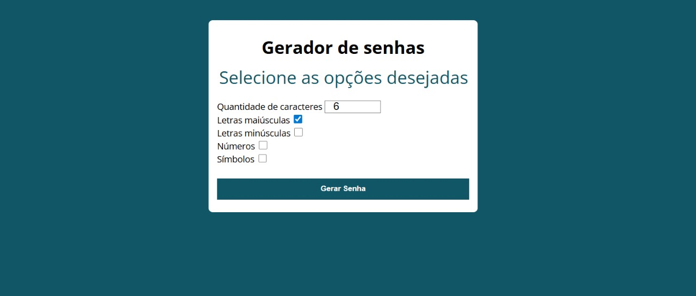

# 🔐 PasswordGenerator

## 📌 Descrição
Projeto desenvolvido para gerar **senhas seguras e personalizadas**.  
O usuário pode escolher a quantidade de caracteres e quais tipos de caracteres deseja incluir (maiúsculas, minúsculas, números e símbolos).  
Ao clicar em **Gerar senha**, o sistema cria uma senha válida de acordo com os parâmetros selecionados.

---

## 📂 Estrutura do projeto
- **docs/**
  - `index.html`
  - **Assets/**
    - `bundle.js`
    - `bundle.js.map`
- **src/**
  - `index.js`
  - **Assets/**
    - `modelo.css`
  - **modules/**
    - `formGeraSenha.js` (responsável pela lógica de geração de senhas)
    - `geradores.js` (responsável por validar parâmetros)
- **node_modules/** → dependências instaladas via npm
- `.gitignore`
- `package-lock.json`
- `package.json`
- `webpack.config.js`

---

## ⚙️ Funcionalidades
- Definir a **quantidade de caracteres** da senha.  
- Escolher se a senha terá:
  - Letras maiúsculas (já marcado por padrão)  
  - Letras minúsculas  
  - Números  
  - Símbolos  
- Botão para **gerar senha** instantaneamente.  
- Interface simples e prática.  

---

## 🛠️ Tecnologias utilizadas
- **HTML5** → estrutura da página  
- **CSS3** → estilização visual  
- **JavaScript (ES6+)** → lógica de geração e validação de senhas  
- **Webpack** → empacotamento e criação do `bundle.js`  
- **Babel** → transpilar código moderno para navegadores  
- **Node.js + npm** → gerenciamento de dependências  

---

## 📸 Preview
Tela inicial:


Senha gerada:


---

## 🚀 Como acessar
Você pode acessar o projeto de duas formas:

1. **Online pelo GitHub Pages:**
   👉 [PasswordGenerator](https://wellingthonschuh.github.io/PasswordGenerator/)

2. **Rodar localmente:**
   - Baixe ou clone este repositório:
     ```bash
     git clone https://github.com/WellingthonSchuh/PasswordGenerator.git
     ```
   - Instale as dependências:
     ```bash
     npm install
     ```
   - Gere o bundle com o Webpack:
     ```bash
     npx webpack
     ```
   - Abra o arquivo `docs/index.html` em qualquer navegador.

---

## 📚 Aprendizados
- Criação de senhas seguras com diferentes parâmetros.  
- Uso de **checkboxes** para personalizar a senha.  
- Modularização do código com `import/export`.  
- Configuração e uso do **Webpack** para empacotar projetos.  
- Instalação e configuração do **Babel** para transpilar código.  
- Organização de pastas em projetos reais.  

---

## 👨‍💻 Autor
Feito por **Wellingthon Schuh**  
🔗 [LinkedIn](https://www.linkedin.com/in/wellingthonschuh)
